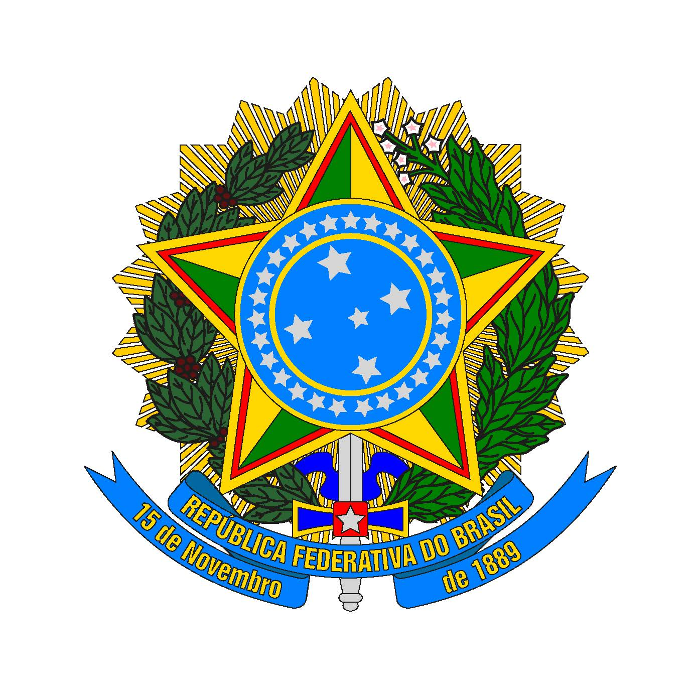
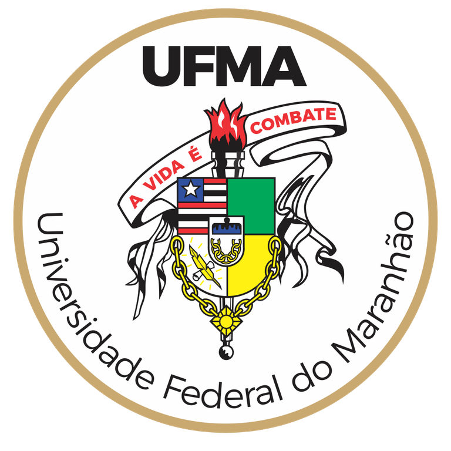

---
title: "Expediente"
---

::: {.text-center}
{width=180 height=220 fig-align="center"}

**REPÚBLICA FEDERATIVA DO BRASIL**

**Luiz Inácio Lula da Silva**  
Presidente da República

**Silvio Costa Filho**  
Ministro de Portos e Aeroportos

---

**AGÊNCIA NACIONAL DE TRANSPORTES AQUAVIÁRIOS (ANTAQ)**

**EQUIPE TÉCNICA – ANTAQ**

**Superintendência de ESG e Inovação – SESGI**  
Cristina Castro Lucas de Souza

**Gerência de Meio Ambiente e Sustentabilidade – GMS**  
Uirá Cavalcante Oliveira  
Patrícia Gonçalves de Oliveira  
Rodrigo Baudson Godoi Silva

---

**ELABORAÇÃO**

**Universidade Federal do Maranhão**  
Laboratório de Pesquisa LabPortos

**EQUIPE TÉCNICA – UFMA – LabPortos**

Prof. Dr. Sérgio Cutrim  
Prof. Dr. Tadeu Gomes Teixeira  
Prof. Dr. Leo Tadeu Robles  
Prof. Dra. Darliane Ribeiro Cunha  
Profa. Dra. Cassia Bömer Galvão  
Profa. Dra. Susanne Ferreira Cutrim  
MSc. Carlos Albuquerque  
MSc. Felipe Scarpelli

---

**COORDENAÇÃO UFMA**

**Prof. Dr. Sérgio Cutrim**  
Coordenação Geral

**Prof. Dr. Tadeu Gomes Teixeira**  
Coordenação Técnica

**Dr. Fernando Carvalho Silva**  
Reitor

---

**COORDENAÇÃO ANTAQ**

**Uirá Cavalcante**  
Coordenação Institucional

---

Brasília, janeiro de 2026.
:::

::: {.content-visible when-format="pdf"}
\newpage
:::

::: {.content-visible when-format="docx"}
```{=openxml}
<w:p><w:r><w:br w:type="page"/></w:r></w:p>
```
:::


::: {.text-center}
{width=140 height=170 fig-align="center"}

**UNIVERSIDADE FEDERAL DO MARANHÃO**

**Reitor**  

Prof. Dr. Fernando Carvalho Silva


**Vice-Reitor**  

Prof. Dr. Leonardo Silva Soares

**Diretora do Centro de Ciências Sociais**  

Lindalva Martins Maia Maciel
:::


**Licença** 

Este trabalho está licenciado sob a Licença Creative Commons Atribuição 4.0 Internacional (CC BY 4.0).

 {width=60 height=60}


Você tem o direito de:

**Compartilhar** — copiar e redistribuir o material em qualquer suporte ou formato

**Adaptar** — remixar, transformar e criar a partir do material para qualquer fim, mesmo comercial


**Termos:**

**Atribuição** — Você deve dar o crédito apropriado à ANTAQ e à UFMA, prover um link para a licença e indicar se mudanças foram feitas.


**Citação sugerida:**

AGÊNCIA NACIONAL DE TRANSPORTES AQUAVIÁRIOS (ANTAQ); UNIVERSIDADE FEDERAL DO MARANHÃO (UFMA). **Riscos Globais Portuários**. Brasília: ANTAQ, 2026.
