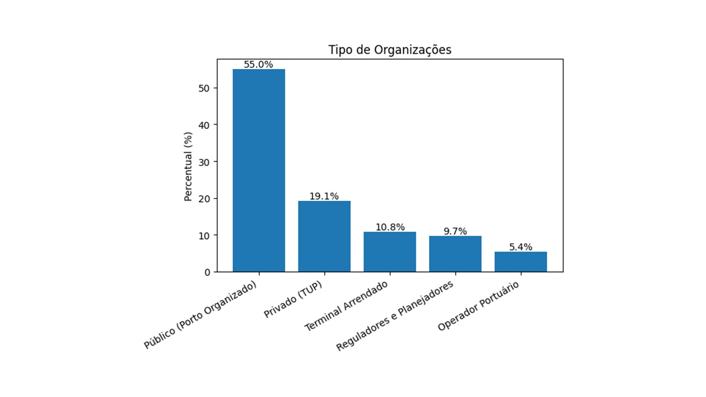
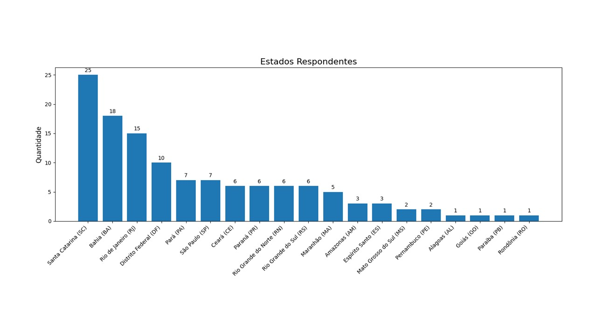
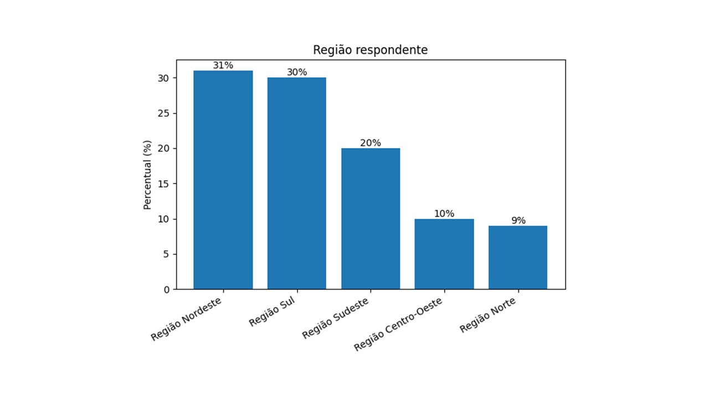
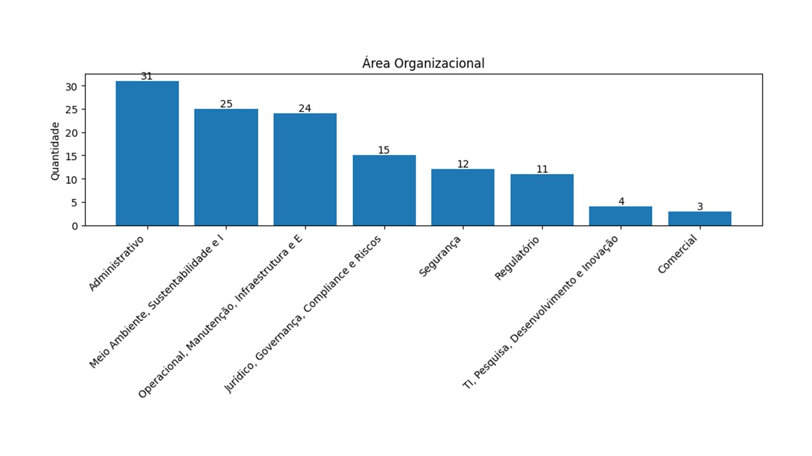

Este capítulo apresenta o desenho metodológico adotado para avaliar os riscos portuários nas diferentes dimensões analisadas no contexto brasileiro.

## Fases Metodológicas 

A elaboração do relatório Riscos Globais Portuário Brasil seguiu uma abordagem mista de caráter exploratório, descritivo e comparativo, estruturada em seis fases integradas que combinam revisão teórica, coleta empírica e tratamento estatístico de dados. O processo metodológico foi desenhado para capturar, analisar e classificar a percepção de riscos que afetam o sistema portuário brasileiro em múltiplas dimensões (econômica, ambiental, social, tecnológica, geopolítica e de governança).

**Fase 1 – Revisão sistemática da literatura**

Foi conduzida uma revisão sistemática em bases de dados nacionais e internacionais com o objetivo de identificar tendências, categorias e abordagens metodológicas utilizadas em pesquisas sobre riscos globais, sustentabilidade e gestão portuária. Essa etapa assegurou a fundamentação teórica do estudo e permitiu a identificação de lacunas de pesquisa no contexto brasileiro.

**Fase 2 – Análise de riscos mapeados em relatórios corporativos e institucionais**

Foram examinados relatórios de sustentabilidade, relatos integrados e documentos de gestão de riscos de autoridades portuárias, terminais privados e organismos internacionais. Essa análise possibilitou compreender a forma como riscos emergentes vêm sendo relatados e gerenciados no setor, permitindo alinhar o modelo proposto às práticas mais consolidadas de governança e transparência.

**Fase 3 – Benchmarking do Relatório de Riscos Globais do Fórum Econômico Mundial**

A estrutura conceitual e a metodologia de classificação do Global Risks Report (World Economic Forum) foram utilizadas como referência comparativa. O benchmarking permitiu adaptar as categorias globais de risco ao contexto portuário brasileiro, garantindo comparabilidade internacional e coerência terminológica entre dimensões e subdimensões de análise.

**Fase 4 – Coleta de dados com gestores e representantes institucionais**
Foi aplicado um formulário eletrônico estruturado a representantes de instalações portuárias públicas e privadas, órgãos reguladores e fiscalizadores, com o objetivo de coletar percepções sobre a probabilidade e o impacto dos diferentes tipos de risco. Essa etapa representou o núcleo da coleta empírica e garantiu diversidade geográfica e institucional entre os respondentes.

**Fase 5 – Coleta de dados com especialistas, professores e pesquisadores do setor portuário**

Profissionais com larga experiência no setor foram convidados a participar da pesquisa, contribuindo com avaliações qualitativas e quantitativas baseadas em vivências práticas. Essa amostra representou o conhecimento acumulado de gestores, engenheiros, planejadores e consultores com trajetória consolidada na gestão portuária brasileira.

**Fase 6 – Tratamento e análise estatística dos dados**

Os dados coletados foram processados por meio de técnicas de estatística descritiva, incluindo cálculo de média, mediana, desvio padrão, coeficiente de variação e delta temporal. O uso dessas medidas permitiu identificar a dispersão das percepções e a evolução esperada de cada risco em três horizontes de tempo: imediato (2025), curto prazo (2026–2027) e longo prazo (2035). 


## Fontes de Dados

- Foram aplicados questionários estruturados a gestores do setor portuário brasileiro. Os questionários foram encaminhados pela ANTAQ às Autoridades Portuárias, ao Ministério de Portos e Aeroportos (MPor), Terminais de Uso Privado (TUPs) e à INFRA S.A  para participação voluntária e a tabulação dos dados e análise executada pela equipe do LabPortos e parceiros. 

Foram obtidas 125 (cento e vinte e cinco) respostas voluntárias de gestores e especialistas do setor portuário. Trata-se, portanto, de uma amostra não probabilística. 

## Perfil dos respondentes

Os respondentes da pesquisa representam os diversos tipos de organização do setor portuário, com 55% pertencendo aos portos organizados públicos. 



Santa Catarina, Bahia e Rio de Janeiro foram os estados com as maiores adesões de respondentes. 



Quando analisado pelo recorte regional, o Nordeste apresentou a maior adesão de respondentes. 



Pelo recorte de área de atuação organizacional, verifica-se que a maioria pertence à área de gestão, meio ambiente e sustentabilidade e operacional.  





## Horizonte Temporal

Os riscos foram avaliados considerando três horizontes temporais, permitindo distinguir ameaças urgentes de tendências estruturais e orientar ações de curto, médio e longo prazo:

- **Imediato (2025)** – Riscos que requerem atenção e resposta imediata, exigindo capacidade de reação rápida e protocolos de contingência.

- **Curto prazo (2026-2027)** – Riscos emergentes que demandam planejamento estratégico, investimentos direcionados e ajustes regulatórios.

- **Longo prazo (até 2035)** – Riscos estratégicos que requerem visão de futuro, transformações estruturais e construção de resiliência institucional.

Essa abordagem temporal possibilita identificar não apenas os desafios presentes, mas também antecipar cenários futuros, subsidiar o planejamento de infraestrutura portuária de longo ciclo de maturação e orientar políticas públicas que integrem respostas emergenciais, ajustes táticos e transformações estratégicas do setor.

## Variáveis por Dimensão

O questionário original contemplou um total de 76 variáveis distribuídas em cinco dimensões de análise, proporcionando uma visão abrangente e multicritérios dos riscos que afetam o setor portuário brasileiro. Essa estrutura foi desenhada para capturar a complexidade e interdependência dos riscos em diferentes níveis e dimensões da atividade portuária.

- **Dimensão Econômica**: 21 variáveis – abrangem riscos relacionados à estabilidade financeira, endividamento, inflação, competitividade portuária, regulação e estabilidade macroeconômica, capturando desafios estruturais e conjunturais que afetam a viabilidade econômica das operações portuárias.

- **Dimensão Ambiental**: 17 variáveis – envolvem questões como mudanças climáticas, biodiversidade, poluição (atmosférica, hídrica e de sedimentos), desastres naturais, gerenciamento de resíduos, descarbonização do transporte marítimo e licenciamento ambiental, refletindo a crescente importância da sustentabilidade ambiental na gestão portuária.

- **Dimensão Geopolítica**: 7 variáveis – compreendem conflitos geoeconômicos, conflitos armados, violência em países de relação, terrorismo, ameaças biológicas/químicas/nucleares, alterações em sistemas terrestres e migração forçada, representando riscos externos e internacionais que podem impactar o comércio e a segurança portuária.

- **Dimensão Social**: 15 variáveis – abordam direitos humanos, pandemias, serviços públicos essenciais, acidentes, gestão de crises, recursos humanos capacitados, assédio no trabalho, desigualdades, participação social e adoção de novas tecnologias no ambiente laboral, destacando a importância do capital humano e das relações trabalhistas para a operação portuária.

- **Dimensão Tecnológica**: 16 variáveis – englobam riscos associados à inteligência artificial, tecnologias avançadas, segurança cibernética, privacidade, automação portuária, navios autônomos, tecnologias espaciais, integração de sistemas, desenvolvimento seguro de software e custo de implementação tecnológica, refletindo os desafios e oportunidades da transformação digital no setor portuário.

Essa estrutura multicritérios permite uma análise abrangente e integrada dos riscos portuários, considerando diferentes perspectivas e interdependências entre as dimensões analisadas. Cada variável foi avaliada nos três horizontes temporais (imediato 2025, curto prazo 2026-2027 e longo prazo até 2035), totalizando 233 itens de coleta de dados que capturam a evolução temporal da percepção dos riscos.

## Escala Likert e Tratamento Estatístico

### Natureza dos Dados

A coleta de dados utilizou uma escala Likert de 5 pontos para avaliar a percepção dos gestores sobre os riscos portuários:

- 1 - Risco muito baixo
- 2 - Risco baixo
- 3 - Risco moderado
- 4 - Risco alto
- 5 - Risco muito alto.

### Cálculo de Medidas de Tendência Central

A média foi calculada como a soma de todas as respostas dividida pelo número total de respondentes para cada variável:

$$\bar{x} = \frac{\sum_{i=1}^{n} x_i}{n}$$

Onde:

- $\bar{x}$ = média da variável;
- $x_i$ = valor da resposta do i-ésimo respondente (1 a 5);
- $n$ = número total de respondentes.
Interpretação da média:

- 1,0 - 1,9: Percepção de risco muito baixo
- 2,0 - 2,9: Percepção de risco baixo
- 3,0 - 3,9: Percepção de risco moderado
- 4,0 - 4,9: Percepção de risco alto
- 5,0: Percepção de risco muito alto.
A mediana representa o valor central quando todas as respostas são ordenadas. Para dados em escala Likert, a mediana é particularmente útil pois:

- Não é afetada por valores extremos (outliers)
- Representa a posição típica do grupo
- É mais robusta para distribuições assimétricas.
Foram usadas as duas medidas pois fornecem uma visão complementar:

- Média: Captura a intensidade geral das percepções
- Mediana: Indica a posição central e é resistente a extremos.

#### Interpretação Conjunta

- Média ≈ Mediana: Distribuição simétrica, consenso claro
- Média > Mediana: Concentração de respostas mais altas, alguns valores extremos elevados
- Média < Mediana: Concentração de respostas mais baixas, alguns valores extremos reduzidos.

### Análise por Dimensão

Para cada dimensão de risco (econômica, ambiental, social, tecnológica e geopolítica), foram calculadas:

1. Médias e medianas individuais para cada variável;2. Médias e medianas agregadas por dimensão;3. Desvio padrão para medir a dispersão das respostas;4. Frequências absolutas e relativas para cada ponto da escala.

### Validade Estatística

A abordagem metodológica adotada segue as melhores práticas para análise de dados Likert:

- Preservação da natureza ordinal dos dados
- Uso adequado de estatísticas descritivas
- Complementaridade entre medidas para análise
- Transparência nos critérios de interpretação.

## Abordagem Analítica

1. Tratamento dos dados: limpeza, padronização e consolidação das respostas.
2. Construção de indicadores: cálculo de percentuais por nível de risco e mediana por horizonte temporal.
3. Visualização e interpretação: elaboração de gráficos comparativos e sínteses interpretativas.

### Análise Estatística de Dispersão Temporal

Para avaliar a evolução percebida dos riscos entre horizontes temporais, foi estruturado um pipeline estatístico de dispersão com manutenção integral dos 57 pares curto vs. longo prazo.

#### Metodologia de Correspondência Temporal

- Identificação de pares temporais: correspondência automática por código da variável entre curto prazo (2026-2027) e longo prazo (até 2035).
- Extração de estatísticas: para cada par calculamos mediana, intervalo interquartil (IQR), delta temporal com sinal (mediana longo - mediana curto) e delta absoluto.
- Classificação de tendência: 
1. Delta positivo: risco aumenta no longo prazo, ou seja, tendência de agravamento;2. Delta negativo: risco diminui no longo prazo, ou seja,  tendência de melhoria;3. Delta zero: risco estável entre os horizontes, equivalente à estabilidade.

#### Interpretação Estatística

- Correlação temporal: coeficiente de Pearson calculado para medir a persistência entre horizontes.
- Análise de deltas: o delta com sinal identifica agravamentos ou melhorias; o delta absoluto resume a magnitude da mudança.
- Quadrantes estratégicos: contagens e percentuais por quadrante alimentam tanto o gráfico quanto a narrativa do relatório.

::: {.content-visible when-format="docx"}
```{=openxml}
<w:p><w:r><w:br w:type="page"/></w:r></w:p>
```
:::

